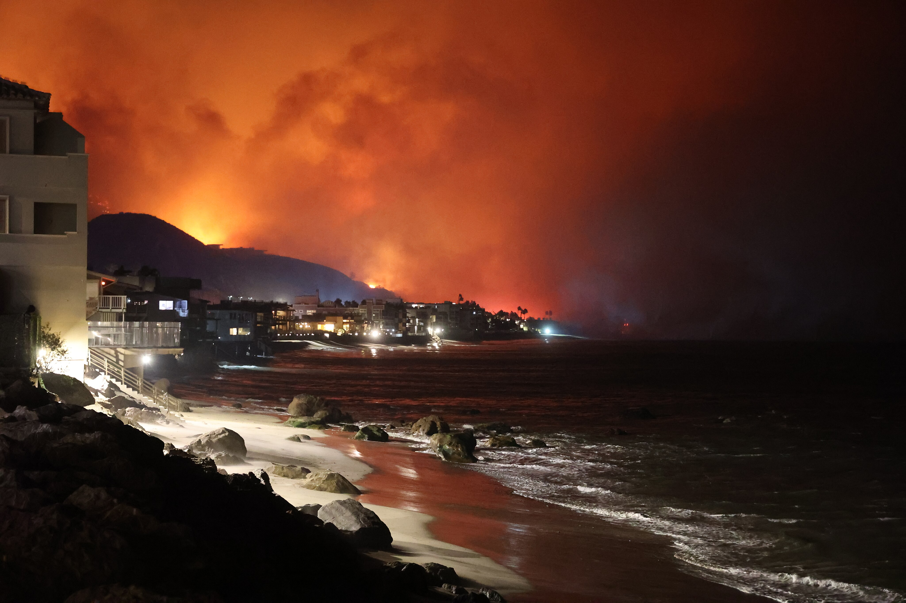

# Observing the Palisades and Eaton Fires with False Color Imagery

Author: Ava Robillard

### About
This repository contains a notebook `hwk4-task2-false-color-ROBILLARD.ipynb` outlining a workflow to create a map showing a [shortwave infrared/near-infrared/red false color image](https://earthobservatory.nasa.gov/features/FalseColor) using Landsat remote sensing data. The image is used along with fire perimeter polygons to highlight the locations of the Palisades Fire and Eaton Fire in Los Angeles County, California that occurred in early January 2025.

The final false color image map created is located in the `images\` directory. 


Photos from the Palisades Fire that started in the City of Los Angeles, January 2025.

### Analysis highlights
- Geospatial data exploration and wrangling with `geopandas`
- NetCDF data exploration and wrangling with `xarray` and `rioxarray`
- Creation of true color and false color images using Landsat bands
- Mapping of vector and raster data and customization with `matplotlib`

### Repository structure
```
eds220-hwk4
├── README.md
├── hwk4-task2-false-color-ROBILLARD.ipynb # Jupyter notebook for analysis
└── images
    ├── falsecolorfires.png  # Final false color map
    └── fire.jpg             # Image used in README
```

### Data

The data for this analysis is not housed in this repository. It was downloaded into a local `data/` folder listed in the `.gitignore` from the City of Los Angeles and Microsoft Planetary Computer, referenced below. 

### References

This assignment was created as a part of EDS 220: Working with Environmental Datasets, taught by Carmen Galaz García.

**Data**

City of Los Angeles. (2025). Palisades and Eaton Dissolved Fire Perimeters (2025) [GIS shapefiles]. Los Angeles GeoHub. Retrieved November 20, 2025, from https://geohub.lacity.org/maps/ad51845ea5fb4eb483bc2a7c38b2370c/about

Microsoft Planetary Computer. (n.d.). Landsat Collection 2 Level‑2 [Dataset]. Microsoft. Retrieved November 20, 2025, from https://planetarycomputer.microsoft.com/dataset/landsat‑c2‑l2

**Images and articles**

Riebeek, H., & Simmon, R. (2014, March 4). Why is that forest red and that cloud blue? How to interpret a false-color satellite image. NASA Earth Observatory. Retrieved November 21, 2025, from https://earthobservatory.nasa.gov/features/FalseColor 

CAL FIRE Official. (2025, January 8). Palisades Fire [Photograph]. Wikimedia Commons. Retrieved November 20, 2025, from https://commons.wikimedia.org/wiki/File:Palisades_Fire_%2854254705864%29.jpg